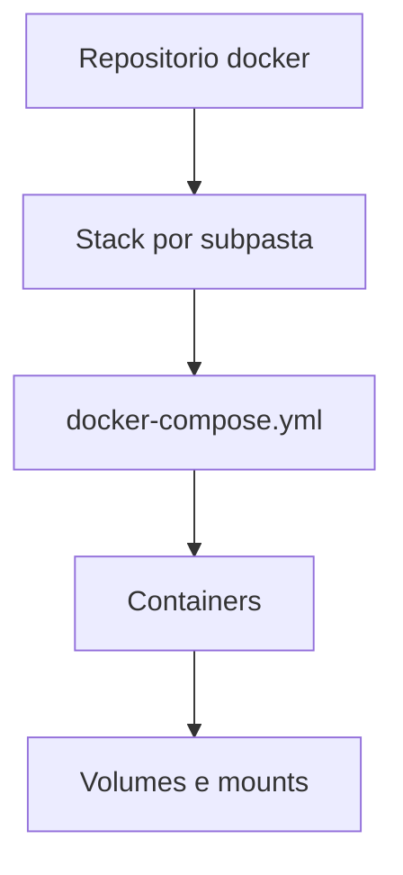

# Docker Stacks

Repositorio catalogo de stacks Docker/Compose para servicos de homelab e operacao.

> Estado do projeto: ativo.
> Este repositorio agrega varias stacks por subpasta.

---

## Ambiente suportado

Previsto para:

* Linux host (Debian/Ubuntu recomendado)
* Docker Engine
* Docker Compose plugin (`docker compose`)

---

## Requisitos

### Sistema

* Docker e Compose instalados
* Permissoes para gerir containers e volumes

### Estrutura

* Cada stack vive numa subpasta propria (ex.: `traefik/`, `forgejo/`, `nextcloud/`)
* Maioria das stacks usa `docker-compose.yml`

---

## Seguranca

* Nao publicar servicos diretamente sem reverse proxy/firewall.
* Rever credenciais e ficheiros `.env` antes de `up`.
* Evitar expor dashboards/admin sem autenticacao.

---

## Instalacao

### 1) Clonar repositorio

```bash
git clone https://forgejo.lbtec.org/lmbalcao/docker.git
cd docker
```

---

### 2) Escolher stack

```bash
cd <stack>
ls
```

---

### 3) Iniciar stack

```bash
docker compose up -d
```

---

## Configuracao

Configurar por stack:

* Ajustar variaveis `.env` quando existirem
* Rever portas em `docker-compose.yml`
* Validar mounts locais antes de subir

---

## Servicos

Exemplos de stacks presentes neste repositorio:

| Stack | Ficheiro base |
| ----- | ------------- |
| `forgejo` | `docker-compose.yml` |
| `traefik` | `docker-compose.yml` |
| `nextcloud` | `docker-compose.yml` |
| `paperless` | `docker-compose.yml` |
| `vscode` | `docker-compose.yml` |
| `mediasuite` | `docker-compose.yml` |

Para listar todas as stacks com compose:

```bash
find . -maxdepth 2 -name 'docker-compose.yml'
```

---

## Persistencia

A persistencia e definida por stack nos volumes/mounts do compose.

Exemplos comuns:

* `/opt/...`
* `/mnt/...`
* volumes nomeados Docker

---

## Arquitetura



---

## Troubleshooting

### Stack nao sobe

```bash
docker compose config
docker compose logs -f
```

### Porta em uso

```bash
ss -lntp | grep <porta>
```

### Volume/permissoes

Validar ownership e paths locais usados nos mounts.

---

## Notas

* Nem todas as subpastas possuem stack ativa.
* Algumas stacks possuem README proprio dentro da subpasta.
* Este README documenta o modelo global do repositorio.
