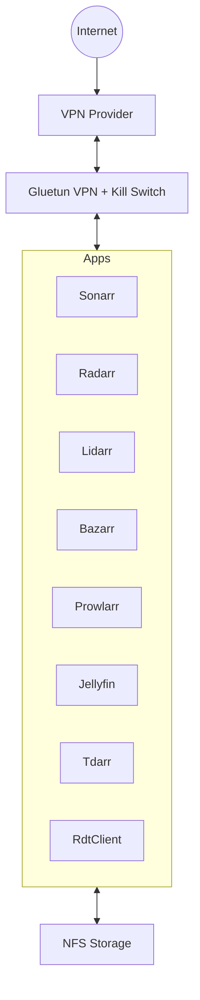

# 🎬 Media Suite


Stack multimédia com **Sonarr, Radarr, Lidarr, Prowlarr, Bazarr, Jellyfin, Tdarr e RdtClient**, com todo o tráfego encapsulado através do **Gluetun (VPN + firewall/kill-switch)**.

> ⚠️ **Estado do projeto:** descontinuado.
> O repositório permanece como referência funcional. Atualizações de imagens podem quebrar o stack.

---

## ✅ Ambiente suportado

Previsto para:

* Linux host (Debian/Ubuntu recomendado)
* Docker Engine
* Docker Compose plugin (`docker compose`)
* Funciona em LXC (ex.: Proxmox) desde que exista suporte a `/dev/net/tun`

---

## 📋 Requisitos

### VPN

* Provedor suportado pelo Gluetun
  https://github.com/qdm12/gluetun
* Credenciais configuradas no `.env`

### Rede

* `/dev/net/tun` disponível no sistema
* Em LXC: permissões e nesting ativos

### Storage

* Partilhas NFS acessíveis
* UID/GID compatíveis com o `.env`

Mounts esperados:

/mnt/media
/mnt/downloads

---

## 🔐 Segurança

* Não expor diretamente à Internet
* Usar firewall ou reverse proxy autenticado
* O kill-switch só funciona se os serviços estiverem ligados ao Gluetun

---

## 🚀 Instalação

### 1) Dependências mínimas

```bash
sudo apt update
sudo apt install -y git sudo
```

Verificar docker:

```bash
docker --version
docker compose version
```

---

### 2) Clonar repositório

```bash
cd /opt
sudo git clone https://github.com/lmbalcao/media-suite.git
cd media-suite
```

---

### 3) Configurar

```bash
cp .env.example .env
nano .env
```

---

### 4) Executar bootstrap

```bash
sudo ./bootstrap_media.sh
```

---

## ⚙️ Configuração (.env)

Exemplo de variáveis típicas:

```
PUID=1000
PGID=1000
TZ=Europe/Lisbon

MEDIA_PATH=/mnt/media
DOWNLOADS_PATH=/mnt/downloads

VPN_SERVICE_PROVIDER=
OPENVPN_USER=
OPENVPN_PASSWORD=
```

Evitar espaços não escapados em valores.

---

## 📡 Serviços

| Aplicação    | Porta | URL                |
| ------------ | ----: | ------------------ |
| Sonarr       |  8989 | http://<host>:8989 |
| Radarr       |  7878 | http://<host>:7878 |
| Lidarr       |  8686 | http://<host>:8686 |
| Prowlarr     |  9696 | http://<host>:9696 |
| Bazarr       |  6767 | http://<host>:6767 |
| Jellyfin     |  8096 | http://<host>:8096 |
| Tdarr WebUI  |  8265 | http://<host>:8265 |
| Tdarr Server |  8266 | http://<host>:8266 |
| RdtClient    |  6500 | http://<host>:6500 |

`<host>` corresponde ao IP da máquina onde corre o Docker.

---

## 📂 Persistência

Pastas criadas automaticamente:

```
/opt/
├── sonarr/
├── radarr/
├── lidarr/
├── prowlarr/
├── bazarr/
├── jellyfin/
├── tdarr/
│   ├── server/
│   ├── configs/
│   └── logs/
└── rdtclient/
```

Media e downloads:

```
/mnt/media
/mnt/downloads
```

---

## 🧭 Arquitetura



---

## 🧰 Troubleshooting

### VPN não liga

```bash
docker logs -f gluetun
```

### Apps sem rede

Confirmar ligação ao Gluetun:

```
network_mode: "service:gluetun"
```

### Problemas permissões

```bash
id
ls -la /mnt
mount | grep /mnt
```

---

## 📝 Notas

* O bootstrap valida o `.env`
* Recomenda-se fixar versões das imagens
* Atualizações automáticas podem quebrar compatibilidade
