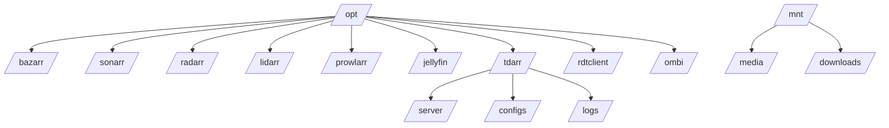

# 🎬 LBTEC Media Suite


Stack multimédia self-hosted com todas as apps encapsuladas atrás do **Gluetun (VPN)**.  
Gestão e deploy feitos via **Coolify** ou `docker compose`.

---

## 📋 Pressupostos

### ⚙️ Dispositivos
- `/dev/net/tun` disponível no host (VPN – Gluetun)  
- `/dev/dri/card0` disponível no host (transcoding HW)  
- `/dev/dri/renderD128` disponível no host (transcoding HW)  

### 👤 Permissões
- UID/GID padrão: **1000:1000** para todas as apps  
- Permissões das pastas no host = permissões esperadas nos contentores  

### 🌐 VPN
- Provedor **VPN** suportado pelo Gluetun

---

## 🛠️ Pré Deploy
```bash 
bash
for d in \
  /opt/bazarr \
  /opt/sonarr \
  /opt/radarr \
  /opt/lidarr \
  /opt/prowlarr \
  /opt/jellyfin \
  /opt/tdarr/server \
  /opt/tdarr/configs \
  /opt/tdarr/logs \
  /opt/rdtclient \
  /opt/ombi \
  /mnt/media \
  /mnt/downloads
do
  mkdir -p "$d"
done

chown -R 1000:1000 \
  /opt/bazarr \
  /opt/sonarr \
  /opt/radarr \
  /opt/lidarr \
  /opt/prowlarr \
  /opt/jellyfin \
  /opt/tdarr \
  /opt/rdtclient \
  /opt/ombi \
  /mnt/media \
  /mnt/downloads
```

---

## 🔄 Após Git Sync

1. Preencher variáveis necessárias no **Coolify** ou em `.env` local:
   - `VPN_SERVICE_PROVIDER`
   - `OPENVPN_USER`
   - `OPENVPN_PASSWORD`
   - (se usares WireGuard: `WIREGUARD_PRIVATE_KEY`, `WIREGUARD_ADDRESSES`, `SERVER_HOST`, etc.)
2. Definir domínios para cada app no proxy (NPM/Traefik/Ingress).

---

## 🚀 Após Deploy

- Configurar individualmente cada aplicação:
  - Bazarr: legendas
  - Sonarr: séries
  - Radarr: filmes
  - Lidarr: música
  - Prowlarr: indexadores
  - Jellyfin: biblioteca multimédia
  - Tdarr: transcodificação
  - RdtClient: downloads
  - Ombi: pedidos dos utilizadores

---

## 📡 Serviços e Portas

| Aplicação        | Porta | URL de acesso (local) |
| ---------------- | ----- | --------------------- |
| **Sonarr**       | 8989  | http\://<host>:8989   |
| **Radarr**       | 7878  | http\://<host>:7878   |
| **Lidarr**       | 8686  | http\://<host>:8686   |
| **Prowlarr**     | 9696  | http\://<host>:9696   |
| **Bazarr**       | 6767  | http\://<host>:6767   |
| **Jellyfin**     | 8096  | http\://<host>:8096   |
| **Tdarr WebUI**  | 8265  | http\://<host>:8265   |
| **Tdarr Server** | 8266  | http\://<host>:8266   |
| **RdtClient**    | 6500  | http\://<host>:6500   |

> ⚠️ Todos os serviços correm **atrás do Gluetun**.
> O acesso externo só funciona se as portas estiverem expostas no `docker-compose.yml`.


---

## 📂 Estrutura de pastas



---

## 📝 TODO
- Colocar caminhos /mnt/media e /mnt/downloads como variáveis (MOUNT_MEDIA, MOUNT_DOWNLOADS)
- Colocar UID/GID como variáveis (PUID, PGID)
- Documentar configuração detalhada de cada aplicação
